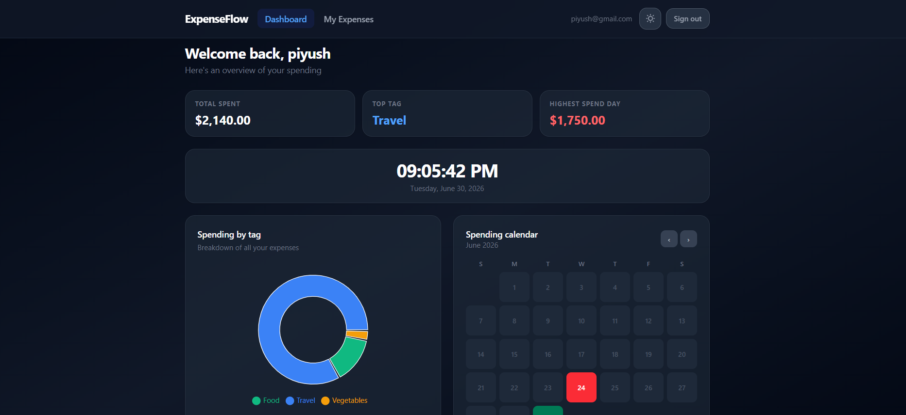

# 💸 ExpenseFlow — Personal Expense Tracker

A full-stack expense tracking web app built with **React + TypeScript + Supabase**, featuring authentication, real-time data, tag-based search, and a visual dashboard.

---

## 🧭 Project Overview

ExpenseFlow lets users log their daily expenses, tag them by category, search and filter by tags, and visualize spending patterns through an interactive dashboard with charts, a live clock, and a color-coded calendar.

---

## 🧭 Preview


## ✨ Features

### 🔐 Authentication
- Sign up with **email, password, and username**
- Log in / log out
- Session managed entirely by **Supabase Auth**
- Protected routes — unauthenticated users redirected to login
- Session persisted across refresh via Supabase's built-in session storage

### ➕ Enter Expenses
- Dialog/modal to add a new expense
- Fields: **amount**, **description**, **date** (calendar picker, defaults to today), **tags** (free-form, e.g. Food, Travel, Vegetables, Rent)
- Tags are user-defined — not a fixed list
- Linked to the logged-in user automatically

### 📋 My Daily Expenses
- View all expenses grouped by date
- Each entry shows: amount, description, tags, date
- Edit or delete any expense
- Search expenses by **tag name**
- Filter by **date range**

### 📊 Dashboard
- **Pie chart** — spending breakdown by tag/category
- **Digital clock** — live, updates every second
- **Calendar heatmap** — each day colored by spend intensity
  - 🟢 Low spend
  - 🟡 Medium spend
  - 🔴 High spend
  - ⬜ No expenses logged
- **Summary cards** — total this month, most expensive day, most used tag

### 🌗 Theme Toggle
- Light / Dark mode
- Persisted in `localStorage`
- Fixed toggle button in top-right corner of every page

---

## 🗂️ Pages & Navigation

| Page | Route | Description |
|---|---|---|
| Login / Signup | `/auth` | Email + password + username auth |
| Dashboard | `/dashboard` | Charts, clock, calendar heatmap |
| My Daily Expenses | `/expenses` | List view, search, filter |
| Enter Expense | `/expenses/new` (or modal) | Add new expense dialog |
| Profile | `/profile` | Username, email, logout |

Header is visible on all protected pages with links to Dashboard, My Daily Expenses, Enter Expense, and Profile.

---

## 🛠️ Tech Stack

| Layer | Technology |
|---|---|
| Frontend | React 18 + TypeScript (strict) |
| Styling | Tailwind CSS v4 |
| State — Server data | TanStack Query (React Query) |
| State — UI/Session | Redux Toolkit |
| Backend & DB | Supabase (PostgreSQL) |
| Auth | Supabase Auth |
| Charts | Recharts |
| Build tool | Vite |

---

## 🗄️ Supabase Database Schema

### `profiles` table
| Column | Type | Notes |
|---|---|---|
| `id` | `uuid` | References `auth.users.id` |
| `username` | `text` | Set on signup |
| `email` | `text` | Mirrored from auth |
| `created_at` | `timestamptz` | Auto |

### `expenses` table
| Column | Type | Notes |
|---|---|---|
| `id` | `uuid` | Primary key |
| `user_id` | `uuid` | References `profiles.id` |
| `amount` | `numeric` | Positive decimal |
| `description` | `text` | What was spent on |
| `date` | `date` | Date of expense |
| `created_at` | `timestamptz` | Auto |

### `tags` table
| Column | Type | Notes |
|---|---|---|
| `id` | `uuid` | Primary key |
| `expense_id` | `uuid` | References `expenses.id` |
| `user_id` | `uuid` | For fast tag search |
| `name` | `text` | e.g. "Food", "Travel" |

Row Level Security (RLS) enabled on all tables — users can only read and write their own data.

---

## 🏗️ State Ownership Contract

| State | Owner | Why |
|---|---|---|
| Supabase session / user | Redux | App-wide, needed in every component |
| Auth loading state | Redux | UI needs to know before render |
| Expenses list | TanStack Query | Server data, needs cache + refetch |
| Tags list | TanStack Query | Server data |
| Selected date filter | Redux | UI state |
| Search tag input | Local `useState` | Component-level UI |
| Dialog open/close | Local `useState` | Component-level UI |
| Theme | `useTheme` hook + localStorage | UI preference, not app data |
---

## 📁 Folder Structure

```
project-root/
├── src/
│   ├── Components/
│   │   ├── AppLayout.tsx
│   │   ├── AuthPage.tsx
│   │   ├── Headers.tsx
│   │   ├── ProtectedRoute.tsx
│   │   └── ThemeToggle.tsx
│   │
│   ├── config/
│   │   └── config.ts
│   │
│   ├── Features/
│   │   ├── auth/
│   │   │   └── authSlice.ts
│   │   │
│   │   ├── Dashboard/
│   │   │   ├── CalendarHeat...tsx
│   │   │   ├── DashboardPa...tsx
│   │   │   ├── dashboardQu...ts
│   │   │   ├── DigitalClock.tsx
│   │   │   └── PieChart.tsx
│   │   │
│   │   └── expense/
│   │       ├── EnterExpense....tsx
│   │       ├── ExpenseDialo...tsx
│   │       ├── ExpenseItem....tsx
│   │       ├── expenseQueri...ts
│   │       ├── Expense....tsx
│   │       └── placeholders.tsx
│   │
│   ├── Hooks/
│   │   ├── useAuth.ts
│   │   └── useTheme.ts
│   │
│   ├── store/
│   │   ├── hooks.ts
│   │   └── store.ts
│   │
│   ├── supabase/
│   │   ├── authService.ts
│   │   ├── client.ts
│   │   ├── dashboardServ....ts
│   │   ├── ExpenseService....ts
│   │   └── profileService.ts
│   │
│   ├── App.css
│   ├── App.tsx
│   ├── index.css
│   ├── main.tsx
│   └── queryClient.ts
│
├── .env
├── .gitignore
├── eslint.config.js
├── index.html
├── package.json
├── package-lock.json
├── README.md
├── tsconfig.app.json
├── tsconfig.json
├── tsconfig.node.json
└── vite.config.ts
```

### Layered architecture — each layer only knows the one below it

```
Supabase Client (config)
    ↓
Service files            (raw async DB calls — no Redux, no React)
    ↓
Redux Slices / TanStack Query   (state management — wraps services)
    ↓
Custom Hooks              (clean interface — wraps slices/queries)
    ↓
Components                (calls hooks only — zero business logic)
```

**Two kinds of hooks in this app — don't mix them up:**

| Hook type | Example | Sits on top of |
|---|---|---|
| TanStack Query hook | `useExpenses()`, `useTagTotals()` | Service file directly |
| Redux selector hook | `useAuth()` | Redux slice |

Components never import `supabase` directly — they only ever call a hook.

---

## 🔐 Auth Flow

```
User visits app
  → ProtectedRoute checks Redux session
  → No session → redirect to /auth
  → Supabase onAuthStateChange fires → dispatch setSession to Redux
  → Session exists → render requested page
```

---

## 🚀 Build Order

```
PHASE 1 — Foundation (no UI yet)
├── .env                          ← VITE_SUPABASE_URL + VITE_SUPABASE_ANON_KEY
├── supabase/client.ts            ← single supabase instance
├── store/store.ts                ← configureStore (empty reducers for now)
└── store/hooks.ts                ← useAppDispatch, useAppSelector

PHASE 2 — Auth layer
├── supabase/authService.ts       ← signUp, signIn, signOut, getSession
├── auth/authSlice.ts             ← session, user, loading in Redux
├── store/store.ts                ← add authReducer
└── auth/AuthPage.tsx             ← login + signup form

PHASE 3 — Routing + protection
├── components/ProtectedRoute.tsx ← checks Redux session
├── components/Header.tsx         ← nav links + theme toggle
├── hooks/useTheme.ts             ← dark/light + localStorage
├── components/ThemeToggle.tsx    ← button UI
└── App.tsx                       ← all routes wired

PHASE 4 — Expenses layer
├── supabase/expenseService.ts    ← getExpenses, addExpense, updateExpense, deleteExpense
├── supabase/tagService.ts        ← addTags, deleteTagsByExpense, searchByTag
├── features/expenses/expenseQueries.ts  ← TanStack Query hooks
├── features/expenses/ExpenseDialog.tsx  ← add/edit modal
├── features/expenses/ExpenseItem.tsx    ← single row
└── features/expenses/ExpensesPage.tsx   ← full page

PHASE 5 — Dashboard
├── supabase/profileService.ts    ← getProfile
├── features/dashboard/DigitalClock.tsx    ← no data needed
├── features/dashboard/PieChart.tsx        ← calls get_tag_totals RPC
├── features/dashboard/CalendarHeatmap.tsx ← calls get_daily_totals RPC
└── features/dashboard/DashboardPage.tsx   ← composes all three
```

Each phase is independently testable before moving to the next — don't start Phase 2 until Phase 1 compiles and runs cleanly.

---

## 📦 Dependencies to Install

```bash
npm install @supabase/supabase-js
npm install @reduxjs/toolkit react-redux
npm install @tanstack/react-query
npm install recharts
npm install react-router-dom
```

---

## 🔑 Environment Variables

```env
VITE_SUPABASE_URL=your_supabase_project_url
VITE_SUPABASE_ANON_KEY=your_supabase_anon_key
```

---

*Built as a learning project to practice React + TypeScript + Supabase full-stack patterns.*